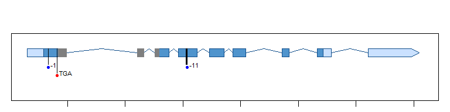
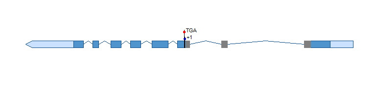
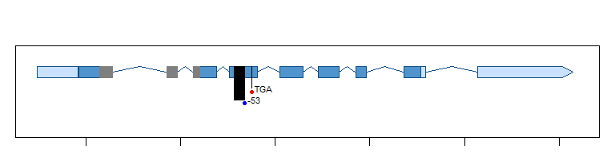

Fig S1
================
Cassandra
8/21/2022

``` r
## for graphing
library(tidyverse)
```

    ## ── Attaching packages ─────────────────────────────────────── tidyverse 1.3.2 ──
    ## ✔ ggplot2 3.4.0      ✔ purrr   0.3.5 
    ## ✔ tibble  3.1.8      ✔ dplyr   1.0.10
    ## ✔ tidyr   1.2.1      ✔ stringr 1.4.1 
    ## ✔ readr   2.1.3      ✔ forcats 0.5.2 
    ## ── Conflicts ────────────────────────────────────────── tidyverse_conflicts() ──
    ## ✖ dplyr::filter() masks stats::filter()
    ## ✖ dplyr::lag()    masks stats::lag()

``` r
library(cowplot)
theme_set(theme_cowplot())

## for gene models 
library(genemodel)
```

# Allele Models

## Load data

``` r
RVE4 <- read.csv("RVE4_AT5G02840.1.csv")
head(RVE4)
```

    ##            type coordinates
    ## 1           ORF    147-2565
    ## 2        5' utr       1-146
    ## 3 coding_region     147-340
    ## 4 coding_region    957-1014
    ## 5 coding_region   1108-1231
    ## 6 coding_region   1315-1473

``` r
RVE6 <- read.csv("RVE6_AT5G52660.2.csv")
head(RVE6)
```

    ##            type coordinates
    ## 1           ORF    237-2851
    ## 2        5' utr       1-236
    ## 3 coding_region     237-502
    ## 4 coding_region   1285-1342
    ## 5 coding_region   1670-1793
    ## 6 coding_region   1887-2054

``` r
RVE8 <- read.csv("RVE8_AT3G09600.1.csv")
head(RVE8)
```

    ##            type coordinates
    ## 1           ORF    221-2032
    ## 2        5' utr       1-220
    ## 3 coding_region     221-399
    ## 4 coding_region     687-744
    ## 5 coding_region     826-949
    ## 6 coding_region   1019-1165

## model for rve468 (supplementary)

Includes models for *rve4-11*, *rve6-11*, and *rve8-11*.

### RVE4

``` r
## rve4 from 89.17 line (G21 -1, G22 -11)

## save rve4-11 model to pdf
#pdf("rve4-11_model.pdf", width = 8.5, height = 2, bg = "white")

## MYB as filled bar in exons
genemodel.plot(model = RVE4, start = 648648, bpstop = 651979, orientation = "forward", xaxis = FALSE)
mutation.plot(648831, 648831, text = "-1", col = "black", drop = -0.2, haplotypes = c("blue"))
mutation.plot(650028, 650038, text = "-11", col = "black", drop = -0.2, haplotypes = c("blue"))
mutation.plot(648906, 648908, text = "TGA", col = "black", drop = -0.4, haplotypes = c("red"))
mutation.plot(648920, 648988, text = "", col = "grey50", drop = 0)
mutation.plot(649604, 649661, text = "", col = "grey50", drop = 0)
mutation.plot(649755, 649793, text = "", col = "grey50", drop = 0)

#dev.off()
```

<!-- -->

### RVE6

``` r
## rve6 from 89.17 line (G24 +1)

## reverse rve6-11 so orientation matches RVE4 and RVE8
#pdf("rve6-11_model_reverse.pdf", width = 8.5, height = 2, bg = "white")

## MYB as filled bar in exons, labels up so model can be reversed
genemodel.plot(model = RVE6, start = 21359001, bpstop = 21362273, orientation = "reverse", xaxis = FALSE)
mutation.plot(21360557, 21360557, text = "+1", col = "black", drop = 0.3, haplotypes = c("blue"))
mutation.plot(21360549, 21360551, text = "TGA", col = "black", drop = 0.5, haplotypes = c("red"))
mutation.plot(21360557, 21360557, text = "", col = "black", drop = 0)
mutation.plot(21360549, 21360551, text = "", col = "black", drop = 0)
mutation.plot(21361839, 21361771, text = "", col = "grey50", drop = 0) 
mutation.plot(21360989, 21360932, text = "", col = "grey50", drop = 0)
mutation.plot(21360604, 21360566, text = "", col = "grey50", drop = 0)

#dev.off()
```

<!-- -->

### RVE8

``` r
## rve8 from 89.17 line (G26 -53)

## save rve8-11 model to pdf
#pdf("rve8-11_model.pdf", width = 8.5, height = 2, bg = "white")

## MYB as filled bar in exons
genemodel.plot(model = RVE8, start = 2946239, bpstop = 2949017, orientation = "forward", xaxis = FALSE)
mutation.plot(2947284, 2947336, text = "-53", col = "black", drop = -0.4, haplotypes = c("blue"))
mutation.plot(2947375, 2947377, text = "TGA", col = "black", drop = -0.2, haplotypes = c("red"))
mutation.plot(2946570, 2946638, text = "", col = "grey50", drop = 0) 
mutation.plot(2946925, 2946982, text = "", col = "grey50", drop = 0)
mutation.plot(2947064, 2947102, text = "", col = "grey50", drop = 0)

#dev.off()
```

<!-- -->
