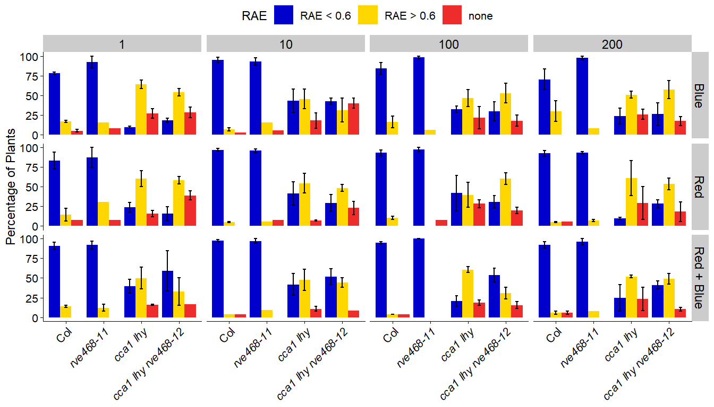

Fig S2
================
Cassandra
8/21/2022

``` r
## for graphing
library(tidyverse)
```

    ## ── Attaching packages ─────────────────────────────────────── tidyverse 1.3.2 ──
    ## ✔ ggplot2 3.4.0      ✔ purrr   0.3.5 
    ## ✔ tibble  3.1.8      ✔ dplyr   1.0.10
    ## ✔ tidyr   1.2.1      ✔ stringr 1.4.1 
    ## ✔ readr   2.1.3      ✔ forcats 0.5.2 
    ## ── Conflicts ────────────────────────────────────────── tidyverse_conflicts() ──
    ## ✖ dplyr::filter() masks stats::filter()
    ## ✖ dplyr::lag()    masks stats::lag()

``` r
library(cowplot)
theme_set(theme_cowplot())

## for genotype manipulation
library(glue)
library(ggtext)
```

# B, R, R+B FRRC

Examine rhythmicity of genotypes in all tested fluence rates of blue,
red, and red + blue light.

## load and format data

### initial formatting

``` r
# load data
rhythmicity <- read_csv("Dull_FRRC_rhythmicity_quint.csv")
```

    ## Rows: 2256 Columns: 9
    ## ── Column specification ────────────────────────────────────────────────────────
    ## Delimiter: ","
    ## chr (3): Experiment, Genotype, Condition
    ## dbl (6): Region, Intensity, Period, Amplitude, Phase, RAE
    ## 
    ## ℹ Use `spec()` to retrieve the full column specification for this data.
    ## ℹ Specify the column types or set `show_col_types = FALSE` to quiet this message.

``` r
# change factors 
rhythmicity <- rhythmicity %>% mutate(
  Experiment = as_factor(Experiment),
  Genotype = as_factor(Genotype),
  Condition = as_factor(Condition),
  RAE_class = as_factor(case_when(RAE <= 0.6 ~ "RAE < 0.6",
                        RAE > 0.6 ~ "RAE > 0.6",
                        is.na(RAE) ~ "none")))

# order RAE_class
rhythmicity$RAE_class = as_factor(rhythmicity$RAE_class) %>% 
  ordered(levels = c("none", "RAE > 0.6", "RAE < 0.6"))

summary(rhythmicity)
```

    ##    Experiment      Region                     Genotype   Condition  
    ##  Dull625:254   Min.   :  1.0   cca1 lhy-100       :446   cB   :830  
    ##  Dull632:247   1st Qu.:115.8   cca1 lhy-100 rve468:450   cR   :755  
    ##  Dull622:241   Median :253.5   Col                :886   cR+cB:671  
    ##  Dull626:225   Mean   :250.2   rve468             :474              
    ##  Dull633:225   3rd Qu.:359.0                                        
    ##  Dull634:192   Max.   :553.0                                        
    ##  (Other):872                                                        
    ##    Intensity          Period        Amplitude           Phase        
    ##  Min.   :  1.00   Min.   :15.03   Min.   :  161.1   Min.   :-17.400  
    ##  1st Qu.: 10.00   1st Qu.:24.06   1st Qu.: 1957.0   1st Qu.: -3.595  
    ##  Median : 10.00   Median :25.94   Median : 4575.0   Median :  6.450  
    ##  Mean   : 74.39   Mean   :26.10   Mean   : 6765.2   Mean   :  3.306  
    ##  3rd Qu.:100.00   3rd Qu.:28.95   3rd Qu.: 9415.0   3rd Qu.: 10.395  
    ##  Max.   :200.00   Max.   :34.96   Max.   :65030.0   Max.   : 17.210  
    ##                   NA's   :185     NA's   :185       NA's   :185      
    ##       RAE             RAE_class   
    ##  Min.   :0.0800   none     : 185  
    ##  1st Qu.:0.2500   RAE > 0.6: 549  
    ##  Median :0.3900   RAE < 0.6:1522  
    ##  Mean   :0.4462                   
    ##  3rd Qu.:0.6200                   
    ##  Max.   :1.0000                   
    ##  NA's   :185

### summarize RAE class counts

Calculate the number of plants for each RAE class when grouped by
Genotype, Condition, Intensity, and Experiment. Also calculate the total
number of plants across the three RAE groups.

``` r
# group to get counts for each RAE class
br_counts <- rhythmicity %>% group_by(Genotype, Condition, Intensity, RAE_class, Experiment) %>% 
  summarise(class_total = n())
```

    ## `summarise()` has grouped output by 'Genotype', 'Condition', 'Intensity',
    ## 'RAE_class'. You can override using the `.groups` argument.

``` r
# group to get total counts for each bar 
br_total <- rhythmicity %>% group_by(Genotype, Condition, Intensity, Experiment) %>% 
  summarise(n = n())
```

    ## `summarise()` has grouped output by 'Genotype', 'Condition', 'Intensity'. You
    ## can override using the `.groups` argument.

``` r
# join, calculate percentage
br_summary <- full_join(br_counts, br_total) %>% 
  mutate(percentage = class_total/n*100) 
```

    ## Joining, by = c("Genotype", "Condition", "Intensity", "Experiment")

``` r
summary(br_summary)
```

    ##                 Genotype  Condition     Intensity          RAE_class  
    ##  cca1 lhy-100       :95   cB   :115   Min.   :  1.00   none     : 73  
    ##  cca1 lhy-100 rve468:94   cR   : 99   1st Qu.:  1.00   RAE > 0.6:106  
    ##  Col                :73   cR+cB: 99   Median : 10.00   RAE < 0.6:134  
    ##  rve468             :51               Mean   : 75.88                  
    ##                                       3rd Qu.:100.00                  
    ##                                       Max.   :200.00                  
    ##                                                                       
    ##    Experiment   class_total           n           percentage     
    ##  Dull622: 39   Min.   : 1.000   Min.   :10.00   Min.   :  2.778  
    ##  Dull626: 37   1st Qu.: 2.000   1st Qu.:13.00   1st Qu.: 15.385  
    ##  Dull632: 36   Median : 5.000   Median :13.00   Median : 38.462  
    ##  Dull633: 35   Mean   : 7.208   Mean   :16.56   Mean   : 43.131  
    ##  Dull625: 34   3rd Qu.: 9.000   3rd Qu.:18.00   3rd Qu.: 69.231  
    ##  Dull634: 28   Max.   :34.000   Max.   :36.00   Max.   :100.000  
    ##  (Other):104

``` r
head(br_summary)
```

    ## # A tibble: 6 × 8
    ## # Groups:   Genotype, Condition, Intensity, RAE_class [2]
    ##   Genotype     Condition Intensity RAE_class Experiment class_to…¹     n perce…²
    ##   <fct>        <fct>         <dbl> <ord>     <fct>           <int> <int>   <dbl>
    ## 1 cca1 lhy-100 cB                1 none      Dull620             4    17    23.5
    ## 2 cca1 lhy-100 cB                1 none      Dull622             5    13    38.5
    ## 3 cca1 lhy-100 cB                1 none      Dull632             2    11    18.2
    ## 4 cca1 lhy-100 cB                1 RAE > 0.6 Dull620            11    17    64.7
    ## 5 cca1 lhy-100 cB                1 RAE > 0.6 Dull622             7    13    53.8
    ## 6 cca1 lhy-100 cB                1 RAE > 0.6 Dull632             8    11    72.7
    ## # … with abbreviated variable names ¹​class_total, ²​percentage

``` r
# average reps, calculate SD and SEM
br_reps <- br_summary %>% group_by(Genotype, Condition, Intensity, RAE_class) %>% 
  summarise(count = n(),
            avg_percentage = mean(percentage),
            sd = sd(percentage),
            sem = sd / sqrt(count))
```

    ## `summarise()` has grouped output by 'Genotype', 'Condition', 'Intensity'. You
    ## can override using the `.groups` argument.

``` r
summary(br_reps)
```

    ##                 Genotype  Condition    Intensity          RAE_class 
    ##  cca1 lhy-100       :36   cB   :44   Min.   :  1.00   none     :36  
    ##  cca1 lhy-100 rve468:36   cR   :44   1st Qu.:  1.00   RAE > 0.6:46  
    ##  Col                :31   cR+cB:42   Median : 10.00   RAE < 0.6:48  
    ##  rve468             :27              Mean   : 75.18                 
    ##                                      3rd Qu.:100.00                 
    ##                                      Max.   :200.00                 
    ##                                                                     
    ##      count       avg_percentage          sd              sem        
    ##  Min.   :1.000   Min.   :  2.857   Min.   : 0.000   Min.   : 0.000  
    ##  1st Qu.:2.000   1st Qu.: 14.056   1st Qu.: 4.441   1st Qu.: 2.564  
    ##  Median :3.000   Median : 29.455   Median : 8.735   Median : 5.556  
    ##  Mean   :2.408   Mean   : 38.442   Mean   :11.607   Mean   : 7.114  
    ##  3rd Qu.:3.000   3rd Qu.: 54.261   3rd Qu.:17.829   3rd Qu.:10.675  
    ##  Max.   :3.000   Max.   :100.000   Max.   :39.167   Max.   :25.641  
    ##                                    NA's   :21       NA's   :21

``` r
# include all classes so that bars are equal sizes when graphed
br_reps <- br_reps %>% complete(RAE_class)
summary(br_reps)
```

    ##                 Genotype  Condition    Intensity          RAE_class 
    ##  cca1 lhy-100       :36   cB   :48   Min.   :  1.00   none     :48  
    ##  cca1 lhy-100 rve468:36   cR   :48   1st Qu.:  7.75   RAE > 0.6:48  
    ##  Col                :36   cR+cB:48   Median : 55.00   RAE < 0.6:48  
    ##  rve468             :36              Mean   : 77.75                 
    ##                                      3rd Qu.:125.00                 
    ##                                      Max.   :200.00                 
    ##                                                                     
    ##      count       avg_percentage          sd              sem        
    ##  Min.   :1.000   Min.   :  2.857   Min.   : 0.000   Min.   : 0.000  
    ##  1st Qu.:2.000   1st Qu.: 14.056   1st Qu.: 4.441   1st Qu.: 2.564  
    ##  Median :3.000   Median : 29.455   Median : 8.735   Median : 5.556  
    ##  Mean   :2.408   Mean   : 38.442   Mean   :11.607   Mean   : 7.114  
    ##  3rd Qu.:3.000   3rd Qu.: 54.261   3rd Qu.:17.829   3rd Qu.:10.675  
    ##  Max.   :3.000   Max.   :100.000   Max.   :39.167   Max.   :25.641  
    ##  NA's   :14      NA's   :14        NA's   :35       NA's   :35

``` r
# order RAE_class
br_reps$RAE_class = as_factor(br_reps$RAE_class) %>% 
  ordered(levels = c("RAE < 0.6", "RAE > 0.6", "none"))
```

### italicize genotypes

**Set up italicized genotype labels.**

``` r
# italicize genotypes
br_reps_styled_tilt <- br_reps %>% mutate(
  gt = as_factor(ifelse(Genotype == "Col", "Col",
                        ifelse(Genotype == "cca1 lhy-100 rve468", 
                               "<i>cca1 lhy rve468-12</i>",
                               ifelse(Genotype == "cca1 lhy-100",
                                      "<i>cca1 lhy</i>",
                                      glue("<i>{Genotype}-11</i>"))))))

summary(br_reps_styled_tilt)
```

    ##                 Genotype  Condition    Intensity          RAE_class 
    ##  cca1 lhy-100       :36   cB   :48   Min.   :  1.00   RAE < 0.6:48  
    ##  cca1 lhy-100 rve468:36   cR   :48   1st Qu.:  7.75   RAE > 0.6:48  
    ##  Col                :36   cR+cB:48   Median : 55.00   none     :48  
    ##  rve468             :36              Mean   : 77.75                 
    ##                                      3rd Qu.:125.00                 
    ##                                      Max.   :200.00                 
    ##                                                                     
    ##      count       avg_percentage          sd              sem        
    ##  Min.   :1.000   Min.   :  2.857   Min.   : 0.000   Min.   : 0.000  
    ##  1st Qu.:2.000   1st Qu.: 14.056   1st Qu.: 4.441   1st Qu.: 2.564  
    ##  Median :3.000   Median : 29.455   Median : 8.735   Median : 5.556  
    ##  Mean   :2.408   Mean   : 38.442   Mean   :11.607   Mean   : 7.114  
    ##  3rd Qu.:3.000   3rd Qu.: 54.261   3rd Qu.:17.829   3rd Qu.:10.675  
    ##  Max.   :3.000   Max.   :100.000   Max.   :39.167   Max.   :25.641  
    ##  NA's   :14      NA's   :14        NA's   :35       NA's   :35      
    ##                          gt    
    ##  <i>cca1 lhy</i>          :36  
    ##  <i>cca1 lhy rve468-12</i>:36  
    ##  Col                      :36  
    ##  <i>rve468-11</i>         :36  
    ##                                
    ##                                
    ## 

``` r
# order styled genotypes 
br_reps_styled_tilt$gt = as_factor(br_reps_styled_tilt$gt) %>% 
  ordered(levels = c("Col", "<i>rve468-11</i>", 
                     "<i>cca1 lhy</i>", 
                     "<i>cca1 lhy rve468-12</i>"))
summary(br_reps_styled_tilt$gt)
```

    ##                       Col          <i>rve468-11</i>           <i>cca1 lhy</i> 
    ##                        36                        36                        36 
    ## <i>cca1 lhy rve468-12</i> 
    ##                        36

### prepare facet labels

``` r
# set up light as more clear labels of Condition
br_reps_styled_tilt <- br_reps_styled_tilt %>% 
  mutate(light = as_factor(case_when(
    Condition == "cB" ~ "Blue",
    Condition == "cR" ~ "Red",
    Condition == "cR+cB" ~ "Red + Blue")))
summary(br_reps_styled_tilt$light)
```

    ##       Blue        Red Red + Blue 
    ##         48         48         48

## check data

``` r
# check out rhythmicity of cca1 lhy rve468 
br_reps_styled_tilt %>% 
  filter(Genotype == "cca1 lhy-100 rve468") %>% 
  filter(RAE_class == "RAE < 0.6")
```

    ## # A tibble: 12 × 10
    ## # Groups:   Genotype, Condition, Intensity [12]
    ##    Genotype        Condi…¹ Inten…² RAE_c…³ count avg_p…⁴    sd   sem gt    light
    ##    <fct>           <fct>     <dbl> <ord>   <int>   <dbl> <dbl> <dbl> <ord> <fct>
    ##  1 cca1 lhy-100 r… cB            1 RAE < …     3    17.9  4.44  2.56 <i>c… Blue 
    ##  2 cca1 lhy-100 r… cB           10 RAE < …     3    42.3  6.66  3.85 <i>c… Blue 
    ##  3 cca1 lhy-100 r… cB          100 RAE < …     3    29.7 21.0  12.1  <i>c… Blue 
    ##  4 cca1 lhy-100 r… cB          200 RAE < …     3    25.9 25.0  14.5  <i>c… Blue 
    ##  5 cca1 lhy-100 r… cR            1 RAE < …     3    15.7 15.3   8.83 <i>c… Red  
    ##  6 cca1 lhy-100 r… cR           10 RAE < …     3    28.9 18.5  10.7  <i>c… Red  
    ##  7 cca1 lhy-100 r… cR          100 RAE < …     2    30.8 10.9   7.69 <i>c… Red  
    ##  8 cca1 lhy-100 r… cR          200 RAE < …     2    28.2  7.25  5.13 <i>c… Red  
    ##  9 cca1 lhy-100 r… cR+cB         1 RAE < …     2    59.0 36.3  25.6  <i>c… Red …
    ## 10 cca1 lhy-100 r… cR+cB        10 RAE < …     2    51.6 14.1   9.94 <i>c… Red …
    ## 11 cca1 lhy-100 r… cR+cB       100 RAE < …     3    53.8 15.4   8.88 <i>c… Red …
    ## 12 cca1 lhy-100 r… cR+cB       200 RAE < …     3    41.0  8.88  5.13 <i>c… Red …
    ## # … with abbreviated variable names ¹​Condition, ²​Intensity, ³​RAE_class,
    ## #   ⁴​avg_percentage

### check seedling count for each rep

``` r
# for supplementary figure 
rhythmicity %>% 
  group_by(Condition, Intensity, Experiment, Genotype) %>% 
  tally() %>% 
  print(n = 135)
```

    ## # A tibble: 135 × 5
    ## # Groups:   Condition, Intensity, Experiment [35]
    ##     Condition Intensity Experiment Genotype                n
    ##     <fct>         <dbl> <fct>      <fct>               <int>
    ##   1 cB                1 Dull620    cca1 lhy-100           17
    ##   2 cB                1 Dull620    cca1 lhy-100 rve468    13
    ##   3 cB                1 Dull620    Col                    36
    ##   4 cB                1 Dull620    rve468                 18
    ##   5 cB                1 Dull622    cca1 lhy-100           13
    ##   6 cB                1 Dull622    cca1 lhy-100 rve468    13
    ##   7 cB                1 Dull622    Col                    26
    ##   8 cB                1 Dull622    rve468                 13
    ##   9 cB                1 Dull632    cca1 lhy-100           11
    ##  10 cB                1 Dull632    cca1 lhy-100 rve468    13
    ##  11 cB                1 Dull632    Col                    25
    ##  12 cB                1 Dull632    rve468                 13
    ##  13 cB               10 Dull617    cca1 lhy-100           18
    ##  14 cB               10 Dull617    cca1 lhy-100 rve468    18
    ##  15 cB               10 Dull617    Col                    35
    ##  16 cB               10 Dull617    rve468                 18
    ##  17 cB               10 Dull622    cca1 lhy-100           13
    ##  18 cB               10 Dull622    cca1 lhy-100 rve468    13
    ##  19 cB               10 Dull622    Col                    25
    ##  20 cB               10 Dull622    rve468                 13
    ##  21 cB               10 Dull632    cca1 lhy-100           11
    ##  22 cB               10 Dull632    cca1 lhy-100 rve468    13
    ##  23 cB               10 Dull632    Col                    22
    ##  24 cB               10 Dull632    rve468                 13
    ##  25 cB              100 Dull620    cca1 lhy-100           15
    ##  26 cB              100 Dull620    cca1 lhy-100 rve468    15
    ##  27 cB              100 Dull620    Col                    35
    ##  28 cB              100 Dull620    rve468                 17
    ##  29 cB              100 Dull622    cca1 lhy-100           12
    ##  30 cB              100 Dull622    cca1 lhy-100 rve468    13
    ##  31 cB              100 Dull622    Col                    25
    ##  32 cB              100 Dull622    rve468                 12
    ##  33 cB              100 Dull632    cca1 lhy-100           13
    ##  34 cB              100 Dull632    cca1 lhy-100 rve468    13
    ##  35 cB              100 Dull632    Col                    23
    ##  36 cB              100 Dull632    rve468                 13
    ##  37 cB              200 Dull617    cca1 lhy-100           16
    ##  38 cB              200 Dull617    cca1 lhy-100 rve468    18
    ##  39 cB              200 Dull617    Col                    35
    ##  40 cB              200 Dull617    rve468                 18
    ##  41 cB              200 Dull622    cca1 lhy-100           13
    ##  42 cB              200 Dull622    cca1 lhy-100 rve468    11
    ##  43 cB              200 Dull622    Col                    13
    ##  44 cB              200 Dull622    rve468                 13
    ##  45 cB              200 Dull632    cca1 lhy-100           12
    ##  46 cB              200 Dull632    cca1 lhy-100 rve468    13
    ##  47 cB              200 Dull632    Col                    26
    ##  48 cB              200 Dull632    rve468                 13
    ##  49 cR                1 Dull621    cca1 lhy-100           17
    ##  50 cR                1 Dull621    cca1 lhy-100 rve468    18
    ##  51 cR                1 Dull621    Col                    35
    ##  52 cR                1 Dull621    rve468                 18
    ##  53 cR                1 Dull624    cca1 lhy-100           10
    ##  54 cR                1 Dull624    cca1 lhy-100 rve468    12
    ##  55 cR                1 Dull624    Col                    26
    ##  56 cR                1 Dull624    rve468                 13
    ##  57 cR                1 Dull633    cca1 lhy-100 rve468    12
    ##  58 cR                1 Dull633    Col                    13
    ##  59 cR                1 Dull633    rve468                 13
    ##  60 cR               10 Dull619    cca1 lhy-100           17
    ##  61 cR               10 Dull619    cca1 lhy-100 rve468    14
    ##  62 cR               10 Dull619    Col                    36
    ##  63 cR               10 Dull619    rve468                 18
    ##  64 cR               10 Dull624    cca1 lhy-100           13
    ##  65 cR               10 Dull624    cca1 lhy-100 rve468    13
    ##  66 cR               10 Dull624    Col                    25
    ##  67 cR               10 Dull624    rve468                 13
    ##  68 cR               10 Dull633    cca1 lhy-100           12
    ##  69 cR               10 Dull633    cca1 lhy-100 rve468    12
    ##  70 cR               10 Dull633    Col                    25
    ##  71 cR               10 Dull633    rve468                 13
    ##  72 cR              100 Dull619    cca1 lhy-100           18
    ##  73 cR              100 Dull619    cca1 lhy-100 rve468    18
    ##  74 cR              100 Dull619    Col                    24
    ##  75 cR              100 Dull619    rve468                 18
    ##  76 cR              100 Dull624    cca1 lhy-100           13
    ##  77 cR              100 Dull624    cca1 lhy-100 rve468    13
    ##  78 cR              100 Dull624    Col                    26
    ##  79 cR              100 Dull624    rve468                 13
    ##  80 cR              100 Dull633    cca1 lhy-100           13
    ##  81 cR              100 Dull633    cca1 lhy-100 rve468    13
    ##  82 cR              100 Dull633    Col                    24
    ##  83 cR              100 Dull633    rve468                 13
    ##  84 cR              200 Dull621    cca1 lhy-100           18
    ##  85 cR              200 Dull621    cca1 lhy-100 rve468    18
    ##  86 cR              200 Dull621    Col                    35
    ##  87 cR              200 Dull621    rve468                 18
    ##  88 cR              200 Dull633    cca1 lhy-100           12
    ##  89 cR              200 Dull633    cca1 lhy-100 rve468    13
    ##  90 cR              200 Dull633    Col                    25
    ##  91 cR              200 Dull633    rve468                 12
    ##  92 cR+cB             1 Dull625    cca1 lhy-100           13
    ##  93 cR+cB             1 Dull625    cca1 lhy-100 rve468    13
    ##  94 cR+cB             1 Dull625    Col                    24
    ##  95 cR+cB             1 Dull625    rve468                 13
    ##  96 cR+cB             1 Dull626    cca1 lhy-100           12
    ##  97 cR+cB             1 Dull626    cca1 lhy-100 rve468    12
    ##  98 cR+cB             1 Dull626    Col                    26
    ##  99 cR+cB             1 Dull626    rve468                 12
    ## 100 cR+cB             1 Dull634    cca1 lhy-100           13
    ## 101 cR+cB             1 Dull634    Col                    13
    ## 102 cR+cB             1 Dull634    rve468                 13
    ## 103 cR+cB            10 Dull625    cca1 lhy-100           13
    ## 104 cR+cB            10 Dull625    cca1 lhy-100 rve468    13
    ## 105 cR+cB            10 Dull625    Col                    25
    ## 106 cR+cB            10 Dull625    rve468                 13
    ## 107 cR+cB            10 Dull626    cca1 lhy-100           13
    ## 108 cR+cB            10 Dull626    Col                    12
    ## 109 cR+cB            10 Dull626    rve468                 11
    ## 110 cR+cB            10 Dull634    cca1 lhy-100           12
    ## 111 cR+cB            10 Dull634    cca1 lhy-100 rve468    12
    ## 112 cR+cB            10 Dull634    Col                    26
    ## 113 cR+cB            10 Dull634    rve468                 13
    ## 114 cR+cB           100 Dull625    cca1 lhy-100           13
    ## 115 cR+cB           100 Dull625    cca1 lhy-100 rve468    13
    ## 116 cR+cB           100 Dull625    Col                    26
    ## 117 cR+cB           100 Dull625    rve468                 12
    ## 118 cR+cB           100 Dull626    cca1 lhy-100           12
    ## 119 cR+cB           100 Dull626    cca1 lhy-100 rve468    13
    ## 120 cR+cB           100 Dull626    Col                    25
    ## 121 cR+cB           100 Dull626    rve468                 12
    ## 122 cR+cB           100 Dull634    cca1 lhy-100           13
    ## 123 cR+cB           100 Dull634    cca1 lhy-100 rve468    13
    ## 124 cR+cB           100 Dull634    Col                    25
    ## 125 cR+cB           100 Dull634    rve468                 13
    ## 126 cR+cB           200 Dull625    cca1 lhy-100           12
    ## 127 cR+cB           200 Dull625    cca1 lhy-100 rve468    13
    ## 128 cR+cB           200 Dull625    Col                    25
    ## 129 cR+cB           200 Dull625    rve468                 13
    ## 130 cR+cB           200 Dull626    cca1 lhy-100           13
    ## 131 cR+cB           200 Dull626    cca1 lhy-100 rve468    13
    ## 132 cR+cB           200 Dull626    Col                    26
    ## 133 cR+cB           200 Dull626    rve468                 13
    ## 134 cR+cB           200 Dull634    cca1 lhy-100 rve468    13
    ## 135 cR+cB           200 Dull634    Col                    13

``` r
rhythmicity %>% 
  group_by(Condition, Intensity, Experiment, Genotype) %>% 
  tally() %>% 
  summary()
```

    ##  Condition    Intensity        Experiment                Genotype 
    ##  cB   :48   Min.   :  1.00   Dull622:16   cca1 lhy-100       :33  
    ##  cR   :43   1st Qu.:  5.50   Dull625:16   cca1 lhy-100 rve468:33  
    ##  cR+cB:44   Median : 10.00   Dull632:16   Col                :35  
    ##             Mean   : 73.96   Dull626:15   rve468             :34  
    ##             3rd Qu.:100.00   Dull633:15                           
    ##             Max.   :200.00   Dull634:13                           
    ##                              (Other):44                           
    ##        n        
    ##  Min.   :10.00  
    ##  1st Qu.:13.00  
    ##  Median :13.00  
    ##  Mean   :16.71  
    ##  3rd Qu.:18.00  
    ##  Max.   :36.00  
    ## 

All reps included. There are 3 reps for everything in cB. There are 3
reps for everything in cR except cca1 lhy at 1 uE and only 2 reps at 200
uE. There are 3 reps for everything in cR+cB except quint at 1 uE and 10
uE, and rve468 and cca1 lhy at 200 uE.

## create figure

### bar graph with error bars

``` r
# figure specifications
facet_label_size <- 18
axis_text_size = 16
axis_title_size = 18
legend_text_size <- 16
legend_title_size <- 18
legend_symbol_size <- unit(2, "line")
point_size = 1.75
point_alpha = 0.5
point_stroke = 1
errorbar_width <- 0.25
errorbar_size <- 0.75
```

``` r
# save to pdf 
#pdf("supp2_bar_sem_tilt.pdf", width = 14, height = 8, bg = "white")

br_reps_styled_tilt %>%  
  ggplot(aes(gt, avg_percentage, fill = RAE_class)) +
  geom_bar(position = position_dodge(), stat = "identity") +
  facet_grid(light ~ Intensity) +
  geom_errorbar(aes(ymin = avg_percentage - sem, 
                    ymax = avg_percentage + sem),
                width = errorbar_width, linewidth = errorbar_size,
                position = position_dodge(0.9)) +
  labs(y = "Percentage of Plants") + 
  scale_fill_manual(values = c("none" = "firebrick2", 
                               "RAE > 0.6" = "gold", 
                               "RAE < 0.6" = "mediumblue"), name = "RAE") +
  theme(axis.title.x = element_blank(),
        axis.text.x = element_markdown(size = axis_text_size, angle = 45, hjust = 1),
        axis.title.y = element_text(size = axis_title_size),
        axis.text.y = element_text(size = axis_text_size),
        strip.text = element_text(size = facet_label_size),
        legend.text = element_text(size = legend_text_size),
        legend.title = element_text(size = legend_title_size),
        legend.position = "top",
        legend.justification = "center",
        legend.key.size = legend_symbol_size)
```

    ## Warning: Removed 14 rows containing missing values (`geom_bar()`).

<!-- -->

``` r
#dev.off()
```
