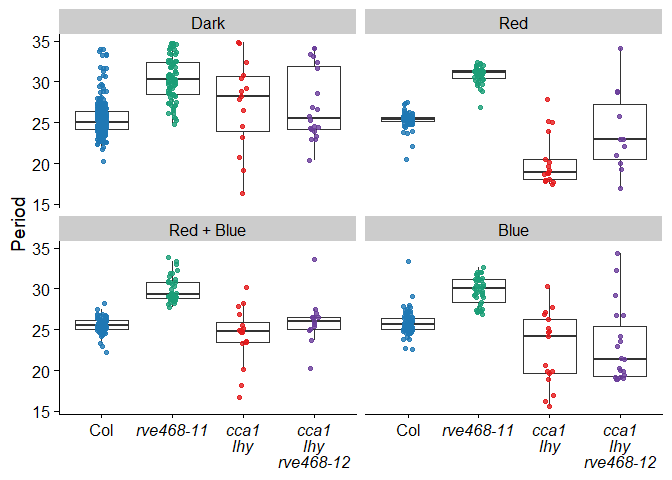
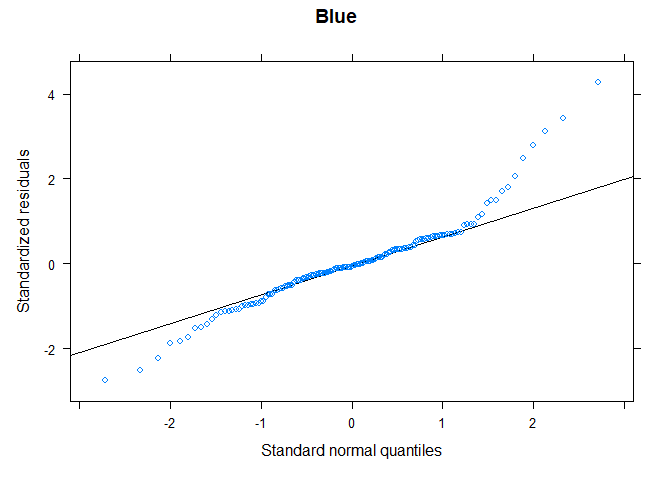
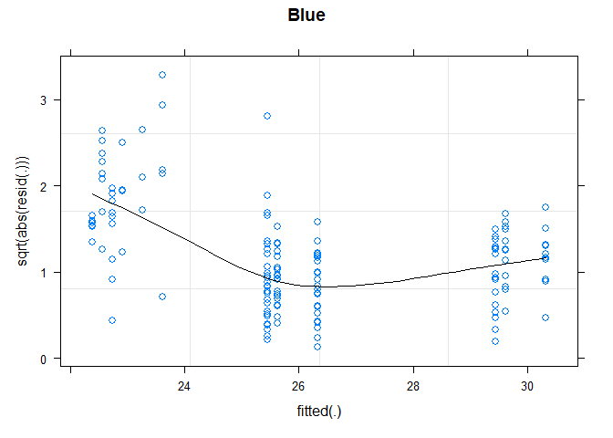
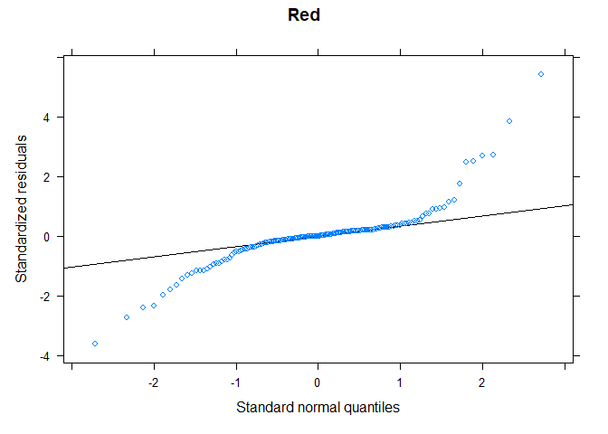
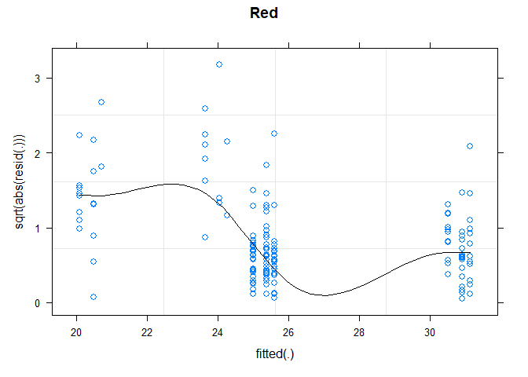
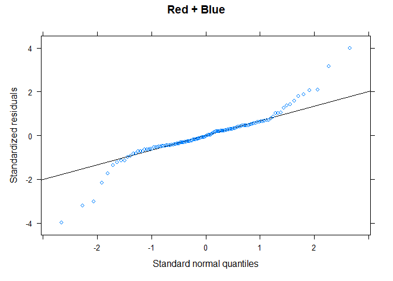
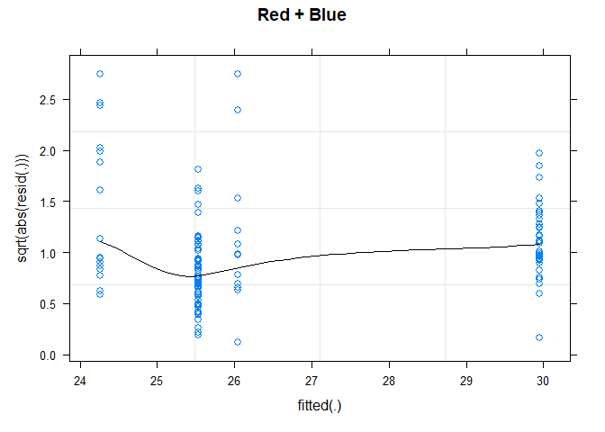
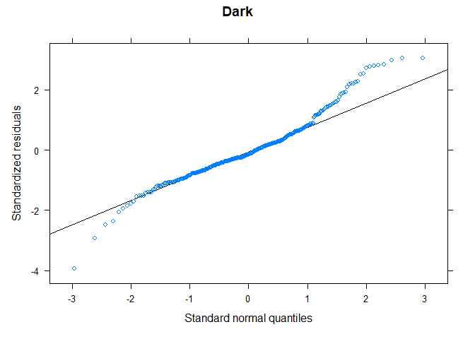
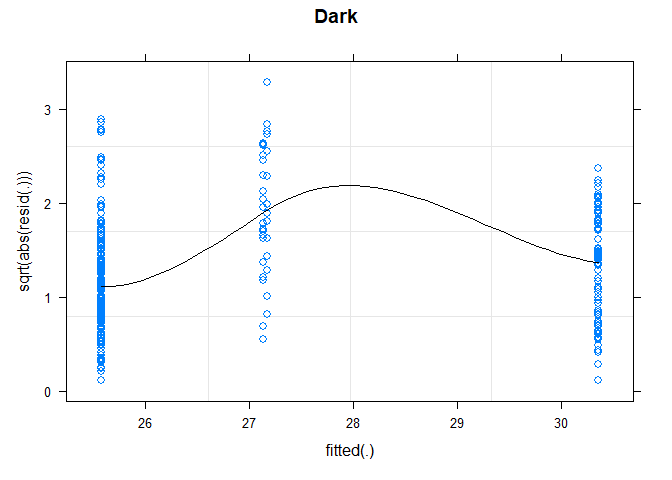
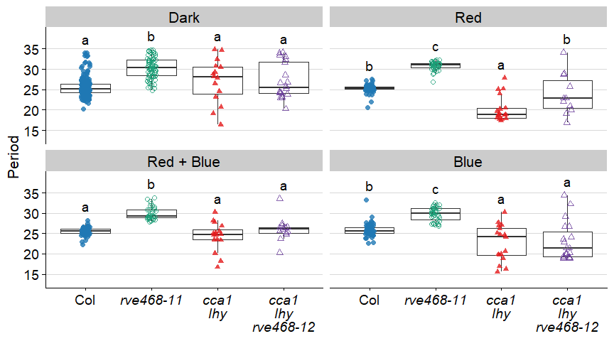

Fig S3
================
Cassandra
8/21/2022

``` r
## for modeling
library(lme4)
```

    ## Loading required package: Matrix

``` r
library(lmerTest)
```

    ## 
    ## Attaching package: 'lmerTest'

    ## The following object is masked from 'package:lme4':
    ## 
    ##     lmer

    ## The following object is masked from 'package:stats':
    ## 
    ##     step

``` r
## for qqmath to get QQ plot
library(lattice)
## for tidy to get p-values
library(broom)
## for Tukey testing and visualization 
library(emmeans)
library(multcomp)
```

    ## Loading required package: mvtnorm

    ## Loading required package: survival

    ## Loading required package: TH.data

    ## Loading required package: MASS

    ## 
    ## Attaching package: 'TH.data'

    ## The following object is masked from 'package:MASS':
    ## 
    ##     geyser

``` r
library(multcompView)

## for graphing
library(tidyverse)
```

    ## ── Attaching packages
    ## ───────────────────────────────────────
    ## tidyverse 1.3.2 ──

    ## ✔ ggplot2 3.4.0      ✔ purrr   0.3.5 
    ## ✔ tibble  3.1.8      ✔ dplyr   1.0.10
    ## ✔ tidyr   1.2.1      ✔ stringr 1.4.1 
    ## ✔ readr   2.1.3      ✔ forcats 0.5.2 
    ## ── Conflicts ────────────────────────────────────────── tidyverse_conflicts() ──
    ## ✖ tidyr::expand() masks Matrix::expand()
    ## ✖ dplyr::filter() masks stats::filter()
    ## ✖ dplyr::lag()    masks stats::lag()
    ## ✖ tidyr::pack()   masks Matrix::pack()
    ## ✖ dplyr::select() masks MASS::select()
    ## ✖ tidyr::unpack() masks Matrix::unpack()

``` r
library(cowplot)
theme_set(theme_cowplot())
## for figure arrangement
library(gridExtra)
```

    ## 
    ## Attaching package: 'gridExtra'
    ## 
    ## The following object is masked from 'package:dplyr':
    ## 
    ##     combine

``` r
## for genotype manipulation
library(glue)
library(ggtext)
```

# B, R, R+B, DD Period Boxplots

Compare period between genotypes in constant darkness, constant 10 uE
red, constant 10 uE blue, and constant 10 uE red + blue light.

## load data

``` r
# load B, R, R+B data
rhythmicity <- read_csv("Dull_FRRC_rhythmicity_quint.csv")
```

    ## Rows: 2256 Columns: 9
    ## ── Column specification ────────────────────────────────────────────────────────
    ## Delimiter: ","
    ## chr (3): Experiment, Genotype, Condition
    ## dbl (6): Region, Intensity, Period, Amplitude, Phase, RAE
    ## 
    ## ℹ Use `spec()` to retrieve the full column specification for this data.
    ## ℹ Specify the column types or set `show_col_types = FALSE` to quiet this message.

``` r
# assign reps by experiment
rhythmicity <- rhythmicity %>% mutate(
  rep = as_factor(case_when(
    Experiment == "Dull617" | 
      Experiment == "Dull619" |
      Experiment == "Dull620" |
      Experiment == "Dull621" |
      Experiment == "Dull625" ~ "1",
    Experiment == "Dull622" |
      Experiment == "Dull624" |
      Experiment == "Dull626" ~ "2",
    Experiment == "Dull632" | 
      Experiment == "Dull633" |
      Experiment == "Dull634" ~ "3")))

summary(rhythmicity$rep)
```

    ##   1   2   3 
    ## 936 656 664

``` r
# load dark data 
dark <- read_csv("Dull_DD_rhythmicity_quint.csv")
```

    ## Rows: 630 Columns: 7
    ## ── Column specification ────────────────────────────────────────────────────────
    ## Delimiter: ","
    ## chr (2): Experiment, Genotype
    ## dbl (5): Region, Period, Amplitude, Phase, RAE
    ## 
    ## ℹ Use `spec()` to retrieve the full column specification for this data.
    ## ℹ Specify the column types or set `show_col_types = FALSE` to quiet this message.

``` r
# add condition and intensity columns
dark <- dark %>% mutate(
  Condition = as_factor("DD"),
  Intensity = 0
)

# assign reps by experiment
dark <- dark %>% mutate(
  rep = as_factor(case_when(
    Experiment == "Dull603" ~ "1",
    Experiment == "Dull606" ~ "2",
    Experiment == "Dull607" ~ "3")))
  
summary(dark$rep)
```

    ##   1   2   3 
    ## 212 206 212

## format data

``` r
# join together
all <- full_join(rhythmicity, dark)
```

    ## Joining, by = c("Experiment", "Region", "Genotype", "Condition", "Intensity",
    ## "Period", "Amplitude", "Phase", "RAE", "rep")

``` r
# change factors 
all <- all %>% mutate(
  Experiment = as_factor(Experiment),
  Genotype = as_factor(Genotype),
  Condition = as_factor(Condition),
  RAE_class = as_factor(case_when(RAE <= 0.6 ~ "RAE < 0.6",
                        RAE > 0.6 ~ "RAE > 0.6",
                        is.na(RAE) ~ "none")))

summary(all)
```

    ##    Experiment       Region                     Genotype    Condition  
    ##  Dull625: 254   Min.   :  1.0   cca1 lhy-100       : 549   cB   :830  
    ##  Dull632: 247   1st Qu.:104.0   cca1 lhy-100 rve468: 555   cR   :755  
    ##  Dull622: 241   Median :238.5   Col                :1200   cR+cB:671  
    ##  Dull626: 225   Mean   :238.9   rve468             : 582   DD   :630  
    ##  Dull633: 225   3rd Qu.:350.0                                         
    ##  Dull603: 212   Max.   :553.0                                         
    ##  (Other):1482                                                         
    ##    Intensity          Period        Amplitude           Phase        
    ##  Min.   :  0.00   Min.   :15.03   Min.   :  161.1   Min.   :-17.400  
    ##  1st Qu.:  1.00   1st Qu.:23.98   1st Qu.: 2212.5   1st Qu.: -3.220  
    ##  Median : 10.00   Median :25.90   Median : 4670.0   Median :  5.700  
    ##  Mean   : 58.15   Mean   :26.09   Mean   : 6869.5   Mean   :  3.013  
    ##  3rd Qu.:100.00   3rd Qu.:28.91   3rd Qu.: 9443.5   3rd Qu.:  9.960  
    ##  Max.   :200.00   Max.   :34.96   Max.   :65030.0   Max.   : 17.210  
    ##                   NA's   :263     NA's   :263       NA's   :263      
    ##       RAE         rep          RAE_class   
    ##  Min.   :0.0800   1:1148   RAE > 0.6: 767  
    ##  1st Qu.:0.2700   2: 862   none     : 263  
    ##  Median :0.4300   3: 876   RAE < 0.6:1856  
    ##  Mean   :0.4689                            
    ##  3rd Qu.:0.6500                            
    ##  Max.   :1.0000                            
    ##  NA's   :263

``` r
# order RAE_class
all$RAE_class = as_factor(all$RAE_class) %>% 
  ordered(levels = c("none", "RAE > 0.6", "RAE < 0.6"))

summary(all)
```

    ##    Experiment       Region                     Genotype    Condition  
    ##  Dull625: 254   Min.   :  1.0   cca1 lhy-100       : 549   cB   :830  
    ##  Dull632: 247   1st Qu.:104.0   cca1 lhy-100 rve468: 555   cR   :755  
    ##  Dull622: 241   Median :238.5   Col                :1200   cR+cB:671  
    ##  Dull626: 225   Mean   :238.9   rve468             : 582   DD   :630  
    ##  Dull633: 225   3rd Qu.:350.0                                         
    ##  Dull603: 212   Max.   :553.0                                         
    ##  (Other):1482                                                         
    ##    Intensity          Period        Amplitude           Phase        
    ##  Min.   :  0.00   Min.   :15.03   Min.   :  161.1   Min.   :-17.400  
    ##  1st Qu.:  1.00   1st Qu.:23.98   1st Qu.: 2212.5   1st Qu.: -3.220  
    ##  Median : 10.00   Median :25.90   Median : 4670.0   Median :  5.700  
    ##  Mean   : 58.15   Mean   :26.09   Mean   : 6869.5   Mean   :  3.013  
    ##  3rd Qu.:100.00   3rd Qu.:28.91   3rd Qu.: 9443.5   3rd Qu.:  9.960  
    ##  Max.   :200.00   Max.   :34.96   Max.   :65030.0   Max.   : 17.210  
    ##                   NA's   :263     NA's   :263       NA's   :263      
    ##       RAE         rep          RAE_class   
    ##  Min.   :0.0800   1:1148   none     : 263  
    ##  1st Qu.:0.2700   2: 862   RAE > 0.6: 767  
    ##  Median :0.4300   3: 876   RAE < 0.6:1856  
    ##  Mean   :0.4689                            
    ##  3rd Qu.:0.6500                            
    ##  Max.   :1.0000                            
    ##  NA's   :263

``` r
# filter for only rhythmic plants
supp3 <- all %>%
  filter(Intensity == 10 | Condition %in% c("DD")) %>% 
  filter(RAE <= 0.6) %>% 
  droplevels()

# change light values for better labels
supp3 <- supp3 %>% 
  mutate(light = as_factor(case_when(
    Condition == "cB" ~ "Blue",
    Condition == "cR" ~ "Red",
    Condition == "cR+cB" ~ "Red + Blue",
    Condition == "DD" ~ "Dark")))

# order light values to match fig 1 layout
supp3$light = as_factor(supp3$light) %>% 
  ordered(levels = c("Dark", "Red",
                     "Red + Blue", "Blue"))

summary(supp3)
```

    ##    Experiment      Region                     Genotype   Condition  
    ##  Dull603:119   Min.   :  1.0   cca1 lhy-100       : 65   cB   :154  
    ##  Dull607:116   1st Qu.:178.5   cca1 lhy-100 rve468: 63   cR   :153  
    ##  Dull606: 99   Median :221.0   Col                :441   cR+cB:126  
    ##  Dull617: 63   Mean   :222.3   rve468             :198   DD   :334  
    ##  Dull619: 61   3rd Qu.:283.5                                        
    ##  Dull625: 54   Max.   :422.0                                        
    ##  (Other):255                                                        
    ##    Intensity          Period        Amplitude         Phase        
    ##  Min.   : 0.000   Min.   :15.63   Min.   :  402   Min.   :-16.700  
    ##  1st Qu.: 0.000   1st Qu.:24.77   1st Qu.: 3149   1st Qu.:  0.405  
    ##  Median :10.000   Median :25.90   Median : 5965   Median :  7.180  
    ##  Mean   : 5.645   Mean   :26.56   Mean   : 8001   Mean   :  4.139  
    ##  3rd Qu.:10.000   3rd Qu.:28.86   3rd Qu.:10985   3rd Qu.: 10.185  
    ##  Max.   :10.000   Max.   :34.83   Max.   :41150   Max.   : 16.850  
    ##                                                                    
    ##       RAE         rep         RAE_class          light    
    ##  Min.   :0.0800   1:297   RAE < 0.6:767   Dark      :334  
    ##  1st Qu.:0.2300   2:209                   Red       :153  
    ##  Median :0.3300   3:261                   Red + Blue:126  
    ##  Mean   :0.3481                           Blue      :154  
    ##  3rd Qu.:0.4700                                           
    ##  Max.   :0.6000                                           
    ## 

## italicize genotypes

**Set up italicized genotype labels.**

``` r
supp3_styled <- supp3 %>% mutate(
  gt = as_factor(ifelse(Genotype == "Col", "Col",
                        ifelse(Genotype == "cca1 lhy-100 rve468", 
                               "<i>cca1<br>lhy<br>rve468-12</i>",
                               ifelse(Genotype == "cca1 lhy-100",
                                      "<i>cca1<br>lhy</i>",
                                      glue("<i>{Genotype}-11</i>"))))))

# order styled genotypes 
supp3_styled$gt = as_factor(supp3_styled$gt) %>% 
  ordered(levels = c("Col", "<i>rve468-11</i>", 
                     "<i>cca1<br>lhy</i>", 
                     "<i>cca1<br>lhy<br>rve468-12</i>"))
summary(supp3_styled$gt)
```

    ##                             Col                <i>rve468-11</i> 
    ##                             441                             198 
    ##              <i>cca1<br>lhy</i> <i>cca1<br>lhy<br>rve468-12</i> 
    ##                              65                              63

## set aesthetic scales

Set shapes by genotype.

``` r
quint_shapes <- c("Col" = 16, "<i>rve468-11</i>" = 1,
                        "<i>cca1<br>lhy</i>" = 17, 
                        "<i>cca1<br>lhy<br>rve468-12</i>" = 2)
```

Set colors by genotype with allele differentiation.

``` r
quint_style_colors <- c("Col" = "#1F78B4", "<i>rve468-11</i>" = "#1B9E77",
                        "<i>cca1<br>lhy</i>" = "#E31A1C", 
                        "<i>cca1<br>lhy<br>rve468-12</i>" = "#6A3D9A")
```

## initial boxplot

``` r
# all reps together
supp3_styled %>% 
  filter(RAE <= 0.6) %>%
  ggplot(aes(gt, Period)) + 
  geom_boxplot(outlier.size = -1) + 
  geom_point(aes(color = gt), alpha = 0.8, position = position_jitterdodge()) +
  facet_wrap(~ light) + 
  scale_color_manual(values = quint_style_colors) + 
  theme(axis.text.x = element_markdown(),
        axis.title.x = element_blank(),
        legend.position = "none")
```

<!-- -->

## stats with lmerTest

Want to examine period \~ genotype. Include experiment or rep as a
random effect.

### check models

``` r
# pull out all conditions that need subsetting (light works for this)
conditions <- unique(supp3_styled$light)
conditions
```

    ## [1] Blue       Red        Red + Blue Dark      
    ## Levels: Dark < Red < Red + Blue < Blue

``` r
# run loop over all quality and intensity subsets
for (i in 1:length(conditions)){
  # subset df
  df <- supp3_styled[supp3_styled$light == conditions[i],]
  # create model 
  model <- lmer(Period ~ Genotype + (1|rep), data = df)
  # set the figures side by side 
  par(mfrow=c(1,2))
  # plot normality of residuals
  print(qqmath(model, main = as.character(conditions[i])))
  # plot equality of variances
  print(plot(model,
       sqrt(abs(resid(.)))~fitted(.),
     type=c("p","smooth"), col.line=1,
     main = as.character(conditions[i])))
}
```

    ## boundary (singular) fit: see help('isSingular')
    ## boundary (singular) fit: see help('isSingular')

    ## Warning in simpleLoess(y, x, w, span, degree = degree, parametric = FALSE, :
    ## pseudoinverse used at 25.553

    ## Warning in simpleLoess(y, x, w, span, degree = degree, parametric = FALSE, :
    ## neighborhood radius 1.5817

    ## Warning in simpleLoess(y, x, w, span, degree = degree, parametric = FALSE, :
    ## reciprocal condition number 8.2149e-16

    ## Warning in simpleLoess(y, x, w, span, degree = degree, parametric = FALSE, :
    ## There are other near singularities as well. 2.4268

    ## Warning in simpleLoess(y, x, w, span, degree = degree, parametric = FALSE, :
    ## pseudoinverse used at 25.553

    ## Warning in simpleLoess(y, x, w, span, degree = degree, parametric = FALSE, :
    ## neighborhood radius 1.5817

    ## Warning in simpleLoess(y, x, w, span, degree = degree, parametric = FALSE, :
    ## reciprocal condition number 0

    ## Warning in simpleLoess(y, x, w, span, degree = degree, parametric = FALSE, :
    ## There are other near singularities as well. 2.4268

    ## Warning in simpleLoess(y, x, w, span, degree = degree, parametric = FALSE, :
    ## pseudoinverse used at 25.553

    ## Warning in simpleLoess(y, x, w, span, degree = degree, parametric = FALSE, :
    ## neighborhood radius 1.5817

    ## Warning in simpleLoess(y, x, w, span, degree = degree, parametric = FALSE, :
    ## reciprocal condition number 0

    ## Warning in simpleLoess(y, x, w, span, degree = degree, parametric = FALSE, :
    ## There are other near singularities as well. 2.4268

    ## Warning in simpleLoess(y, x, w, span, degree = degree, parametric = FALSE, :
    ## pseudoinverse used at 25.553

    ## Warning in simpleLoess(y, x, w, span, degree = degree, parametric = FALSE, :
    ## neighborhood radius 1.5817

    ## Warning in simpleLoess(y, x, w, span, degree = degree, parametric = FALSE, :
    ## reciprocal condition number 0

    ## Warning in simpleLoess(y, x, w, span, degree = degree, parametric = FALSE, :
    ## There are other near singularities as well. 2.4268

    ## Warning in simpleLoess(y, x, w, span, degree = degree, parametric = FALSE, :
    ## pseudoinverse used at 25.553

    ## Warning in simpleLoess(y, x, w, span, degree = degree, parametric = FALSE, :
    ## neighborhood radius 1.5817

    ## Warning in simpleLoess(y, x, w, span, degree = degree, parametric = FALSE, :
    ## reciprocal condition number 8.2149e-16

    ## Warning in simpleLoess(y, x, w, span, degree = degree, parametric = FALSE, :
    ## There are other near singularities as well. 2.4268



**Normality is okay but not great. Red + Blue variance looks okay.**

### ANOVA

``` r
# create results data frame
aov_res <- data.frame(matrix(NA, 
                             nrow = length(1:length(conditions)),
                             ncol = 8))
# assign column names to match tidied Tukey output
colnames(aov_res) <- c("light", "term", "sumsq", "meansq", 
                       "NumDF", "DenDF", "statistic", "p.value")

# run loop over all light subsets
for (i in 1:length(conditions)){
  # subset df
  df <- supp3_styled[supp3_styled$light == conditions[i],]
  # create model 
  model <- lmer(Period ~ Genotype + (1|rep), data = df)
  # specify condition value in results
  aov_res$light[i] <- as.character(conditions[i])
  # run anova
  aov <- anova(model)
  # tidy anova into tibble
  tidied <- tidy(aov)
  # assign tidied variables into results data frame
  aov_res$term[i] <- tidied$term
  aov_res$sumsq[i] <- tidied$sumsq
  aov_res$meansq[i] <- tidied$meansq
  aov_res$NumDF[i] <- tidied$NumDF
  aov_res$DenDF[i] <- tidied$DenDF
  aov_res$statistic[i] <- tidied$statistic
  aov_res$p.value[i] <- tidied$p.value
}
```

    ## Warning in tidy.anova(aov): The following column names in ANOVA output were not
    ## recognized or transformed: NumDF, DenDF

    ## Warning in tidy.anova(aov): The following column names in ANOVA output were not
    ## recognized or transformed: NumDF, DenDF

    ## boundary (singular) fit: see help('isSingular')

    ## Warning in tidy.anova(aov): The following column names in ANOVA output were not
    ## recognized or transformed: NumDF, DenDF

    ## boundary (singular) fit: see help('isSingular')

    ## Warning in tidy.anova(aov): The following column names in ANOVA output were not
    ## recognized or transformed: NumDF, DenDF

``` r
aov_res %>% 
  select(!c("sumsq":"DenDF")) %>% 
  arrange(light)
```

    ##        light     term statistic      p.value
    ## 1       Blue Genotype  48.70963 5.554531e-22
    ## 2       Dark Genotype  58.86000 1.673502e-30
    ## 3        Red Genotype 152.54836 4.547018e-45
    ## 4 Red + Blue Genotype  52.52773 7.190145e-22

**Significant difference in genotype for all of these (Dark, 10B, 10R,
10R+B).**

### Tukey

``` r
# run loop over all light subsets
for (i in 1:length(conditions)){
  # subset df
  df <- supp3_styled[supp3_styled$light == conditions[i],]
  # create model 
  model <- lmer(Period ~ Genotype + (1|rep), data = df)
  # run emmeans 
  emm <- emmeans(model, ~ Genotype)
  # add line of space between results + label condition of tested subset
  cat(paste("", 
            as.character(conditions[i]),
            "", sep = "\n"))
  # print Tukey results in table
  print(pwpm(emm, diffs = FALSE))
}
```

    ## 
    ## Blue
    ##                     cca1 lhy-100 cca1 lhy-100 rve468    Col rve468
    ## cca1 lhy-100              [22.7]              0.9748 <.0001 <.0001
    ## cca1 lhy-100 rve468                           [23.1] 0.0003 <.0001
    ## Col                                                  [25.8] <.0001
    ## rve468                                                      [29.8]
    ## 
    ## Row and column labels: Genotype
    ## Upper triangle: P values   adjust = "tukey"
    ## Diagonal: [Estimates] (emmean) 
    ## 
    ## Red
    ##                     cca1 lhy-100 cca1 lhy-100 rve468    Col rve468
    ## cca1 lhy-100              [20.4]              <.0001 <.0001 <.0001
    ## cca1 lhy-100 rve468                           [24.0] 0.1207 <.0001
    ## Col                                                  [25.3] <.0001
    ## rve468                                                      [30.9]
    ## 
    ## Row and column labels: Genotype
    ## Upper triangle: P values   adjust = "tukey"
    ## Diagonal: [Estimates] (emmean)

    ## boundary (singular) fit: see help('isSingular')

    ## 
    ## Red + Blue
    ##                     cca1 lhy-100 cca1 lhy-100 rve468    Col rve468
    ## cca1 lhy-100              [24.3]              0.0640 0.0938 <.0001
    ## cca1 lhy-100 rve468                           [26.0] 0.8221 <.0001
    ## Col                                                  [25.5] <.0001
    ## rve468                                                      [29.9]
    ## 
    ## Row and column labels: Genotype
    ## Upper triangle: P values   adjust = "tukey"
    ## Diagonal: [Estimates] (emmean)

    ## boundary (singular) fit: see help('isSingular')

    ## 
    ## Dark
    ##                     cca1 lhy-100 cca1 lhy-100 rve468    Col rve468
    ## cca1 lhy-100              [27.2]              1.0000 0.1342 0.0003
    ## cca1 lhy-100 rve468                           [27.1] 0.0775 <.0001
    ## Col                                                  [25.6] <.0001
    ## rve468                                                      [30.4]
    ## 
    ## Row and column labels: Genotype
    ## Upper triangle: P values   adjust = "tukey"
    ## Diagonal: [Estimates] (emmean)

### convert Tukey results into letter groups

Want to know which groups are significantly different from each other,
and which groups are not significantly different.

``` r
# create results data frame
tukey_res <- data.frame(matrix(NA, 
                               nrow = length(1:(length(conditions)*4)),
                               ncol = 8))
# assign column names to match output
colnames(tukey_res) <- c("light", "Genotype", "emmean", "SE", 
                         "df", "lower.CL", "upper.CL", ".group")

# run loop over all light subsets
for (i in 1:length(conditions)){
  # subset df
  df <- supp3_styled[supp3_styled$light == conditions[i],]
  # create model 
  model <- lmer(Period ~ Genotype + (1|rep), data = df)
  # run emmeans 
  emm <- emmeans(model, ~ Genotype)
  # assign groups  
  res <- cld(emm, level = 0.95, Letters = letters)
  for (j in 1:4){
    # set row number based on i and j
    x <- (4*(i-1)) + j
    # specify condition value in results 
    tukey_res$light[x] <- as.character(conditions[i])
    #assign variables into results data frame
    tukey_res$Genotype[x] <- as.character(res$Genotype[j])
    tukey_res$emmean[x] <- res$emmean[j]
    tukey_res$SE[x] <- res$SE[j]
    tukey_res$df[x] <- res$df[j]
    tukey_res$lower.CL[x] <- res$lower.CL[j]
    tukey_res$upper.CL[x] <- res$upper.CL[j]
    tukey_res$.group[x] <- res$.group[j]
  }
}
```

    ## boundary (singular) fit: see help('isSingular')
    ## boundary (singular) fit: see help('isSingular')

``` r
head(tukey_res)
```

    ##   light            Genotype   emmean        SE       df lower.CL upper.CL
    ## 1  Blue        cca1 lhy-100 22.73618 0.6956881 20.06958 21.28532 24.18703
    ## 2  Blue cca1 lhy-100 rve468 23.09324 0.6641051 17.24551 21.69362 24.49286
    ## 3  Blue                 Col 25.80656 0.4311846  3.26795 24.49584 27.11728
    ## 4  Blue              rve468 29.79575 0.5087373  6.28193 28.56433 31.02717
    ## 5   Red        cca1 lhy-100 20.41620 0.5087977 22.24467 19.36169 21.47071
    ## 6   Red cca1 lhy-100 rve468 23.98424 0.6078188 40.90056 22.75663 25.21184
    ##   .group
    ## 1    a  
    ## 2    a  
    ## 3     b 
    ## 4      c
    ## 5    a  
    ## 6     b

``` r
# adjust letter format to plot
tukey_res <- tukey_res %>% 
  mutate(
    light = as_factor(light),
    Genotype = as_factor(Genotype),
    group = sapply(.group, str_remove_all, " "))

# view results
tukey_res %>% 
  select(!c(df:upper.CL))
```

    ##         light            Genotype   emmean        SE .group group
    ## 1        Blue        cca1 lhy-100 22.73618 0.6956881    a       a
    ## 2        Blue cca1 lhy-100 rve468 23.09324 0.6641051    a       a
    ## 3        Blue                 Col 25.80656 0.4311846     b      b
    ## 4        Blue              rve468 29.79575 0.5087373      c     c
    ## 5         Red        cca1 lhy-100 20.41620 0.5087977    a       a
    ## 6         Red cca1 lhy-100 rve468 23.98424 0.6078188     b      b
    ## 7         Red                 Col 25.32846 0.3008286     b      b
    ## 8         Red              rve468 30.86429 0.3620274      c     c
    ## 9  Red + Blue        cca1 lhy-100 24.26313 0.4881356     a      a
    ## 10 Red + Blue                 Col 25.53361 0.2493480     a      a
    ## 11 Red + Blue cca1 lhy-100 rve468 26.04462 0.5498964     a      a
    ## 12 Red + Blue              rve468 29.94639 0.3159589      b     b
    ## 13       Dark                 Col 25.57668 0.1860839     a      a
    ## 14       Dark cca1 lhy-100 rve468 27.13450 0.6189704     a      a
    ## 15       Dark        cca1 lhy-100 27.17467 0.7147119     a      a
    ## 16       Dark              rve468 30.35342 0.3088668      b     b

## format data

Calculate the maximum data point for each condition and genotype so that
Tukey test lettering is displayed at the appropriate position.

``` r
# calculate max period for each gt and condition
max_per <- supp3_styled %>% group_by(light, Genotype) %>% 
  summarise(max_per = max(Period))
```

    ## `summarise()` has grouped output by 'light'. You can override using the
    ## `.groups` argument.

``` r
# order light in Tukey results for joining
tukey_res$light = as_factor(tukey_res$light) %>% 
  ordered(levels = c("Dark", "Red", "Red + Blue", "Blue"))

# join max period into the Tukey results 
(tukey_res <- full_join(tukey_res, max_per))
```

    ## Joining, by = c("light", "Genotype")

    ##         light            Genotype   emmean        SE         df lower.CL
    ## 1        Blue        cca1 lhy-100 22.73618 0.6956881  20.069579 21.28532
    ## 2        Blue cca1 lhy-100 rve468 23.09324 0.6641051  17.245508 21.69362
    ## 3        Blue                 Col 25.80656 0.4311846   3.267950 24.49584
    ## 4        Blue              rve468 29.79575 0.5087373   6.281930 28.56433
    ## 5         Red        cca1 lhy-100 20.41620 0.5087977  22.244672 19.36169
    ## 6         Red cca1 lhy-100 rve468 23.98424 0.6078188  40.900563 22.75663
    ## 7         Red                 Col 25.32846 0.3008286   3.153576 24.39693
    ## 8         Red              rve468 30.86429 0.3620274   6.586061 29.99720
    ## 9  Red + Blue        cca1 lhy-100 24.26313 0.4881356  51.826254 23.28353
    ## 10 Red + Blue                 Col 25.53361 0.2493480   6.654339 24.93773
    ## 11 Red + Blue cca1 lhy-100 rve468 26.04462 0.5498964  49.674938 24.93994
    ## 12 Red + Blue              rve468 29.94639 0.3159589  20.252804 29.28784
    ## 13       Dark                 Col 25.57668 0.1860839   4.426012 25.07906
    ## 14       Dark cca1 lhy-100 rve468 27.13450 0.6189704 199.114549 25.91392
    ## 15       Dark        cca1 lhy-100 27.17467 0.7147119 239.254035 25.76674
    ## 16       Dark              rve468 30.35342 0.3088668  32.835180 29.72490
    ##    upper.CL .group group max_per
    ## 1  24.18703    a       a   30.28
    ## 2  24.49286    a       a   34.39
    ## 3  27.11728     b      b   33.32
    ## 4  31.02717      c     c   32.59
    ## 5  21.47071    a       a   27.86
    ## 6  25.21184     b      b   34.12
    ## 7  26.25999     b      b   27.52
    ## 8  31.73138      c     c   32.36
    ## 9  25.24272     a      a   30.22
    ## 10 26.12949     a      a   28.19
    ## 11 27.14929     a      a   33.58
    ## 12 30.60494      b     b   33.82
    ## 13 26.07430     a      a   33.95
    ## 14 28.35508     a      a   34.11
    ## 15 28.58260     a      a   34.83
    ## 16 30.98193      b     b   34.76

## italicize genotypes in Tukey data frame

``` r
# set up italicized genotypes
tukey_res_styled <- tukey_res %>% mutate(
  gt = as_factor(ifelse(Genotype == "Col", "Col",
                       ifelse(Genotype == "cca1 lhy-100 rve468", "<i>cca1<br>lhy<br>rve468-12</i>",
                       ifelse(Genotype == "cca1 lhy-100", "<i>cca1<br>lhy</i>",
                    glue("<i>{Genotype}-11</i>"))))))

# order styled genotypes 
tukey_res_styled$gt = as_factor(tukey_res_styled$gt) %>% 
  ordered(levels = c("Col", "<i>rve468-11</i>", 
                     "<i>cca1<br>lhy</i>", 
                     "<i>cca1<br>lhy<br>rve468-12</i>"))
summary(tukey_res_styled)
```

    ##         light                  Genotype     emmean            SE        
    ##  Dark      :4   cca1 lhy-100       :4   Min.   :20.42   Min.   :0.1861  
    ##  Red       :4   cca1 lhy-100 rve468:4   1st Qu.:24.19   1st Qu.:0.3142  
    ##  Red + Blue:4   Col                :4   Median :25.69   Median :0.4984  
    ##  Blue      :4   rve468             :4   Mean   :26.13   Mean   :0.4694  
    ##                                         3rd Qu.:27.83   3rd Qu.:0.6106  
    ##                                         Max.   :30.86   Max.   :0.7147  
    ##        df             lower.CL        upper.CL        .group         
    ##  Min.   :  3.154   Min.   :19.36   Min.   :21.47   Length:16         
    ##  1st Qu.:  6.510   1st Qu.:23.15   1st Qu.:25.23   Class :character  
    ##  Median : 20.161   Median :24.94   Median :26.69   Mode  :character  
    ##  Mean   : 45.237   Mean   :25.09   Mean   :27.16                     
    ##  3rd Qu.: 43.094   3rd Qu.:26.58   3rd Qu.:29.09                     
    ##  Max.   :239.254   Max.   :30.00   Max.   :31.73                     
    ##     group              max_per                                    gt   
    ##  Length:16          Min.   :27.52   Col                            :4  
    ##  Class :character   1st Qu.:30.27   <i>rve468-11</i>               :4  
    ##  Mode  :character   Median :33.45   <i>cca1<br>lhy</i>             :4  
    ##                     Mean   :32.24   <i>cca1<br>lhy<br>rve468-12</i>:4  
    ##                     3rd Qu.:34.11                                      
    ##                     Max.   :34.83

## final boxplot

``` r
# size specifications
point_size = 2
point_alpha = 0.8
axis_text_size = 14
axis_title_size = 16
facet_label_size = 16
cld_size = 5
```

``` r
# save supp fig3 to pdf
#pdf("supp3.pdf", width = 9, height = 5, bg = "white")

# all reps together
supp3_styled %>% 
  ggplot(aes(gt, Period)) + 
  geom_boxplot(outlier.size = -1) + 
  geom_point(aes(color = gt, shape = gt), 
             alpha = point_alpha, size = point_size,
             position = position_jitterdodge()) +
  geom_text(data = tukey_res_styled, aes(x = gt, y = (max_per + 3.5),
                                         label = group),
            color = "black", size = cld_size, show.legend = FALSE) + 
  facet_wrap(~ light) + 
  scale_y_continuous(limits = c(13, 39), breaks = c(seq(15, 35, 5))) + 
  background_grid(major = 'y', minor = "none")  +
  scale_colour_manual(values = quint_style_colors) + 
  scale_shape_manual(values = quint_shapes) + 
  theme(axis.text.x = element_markdown(size = axis_text_size),
        axis.title.x = element_blank(),
        axis.text.y = element_text(size = axis_text_size),
        axis.title.y = element_text(size = axis_title_size),
        strip.text = element_text(size = facet_label_size),
        legend.position = "none")
```

<!-- -->

``` r
#dev.off()
```
